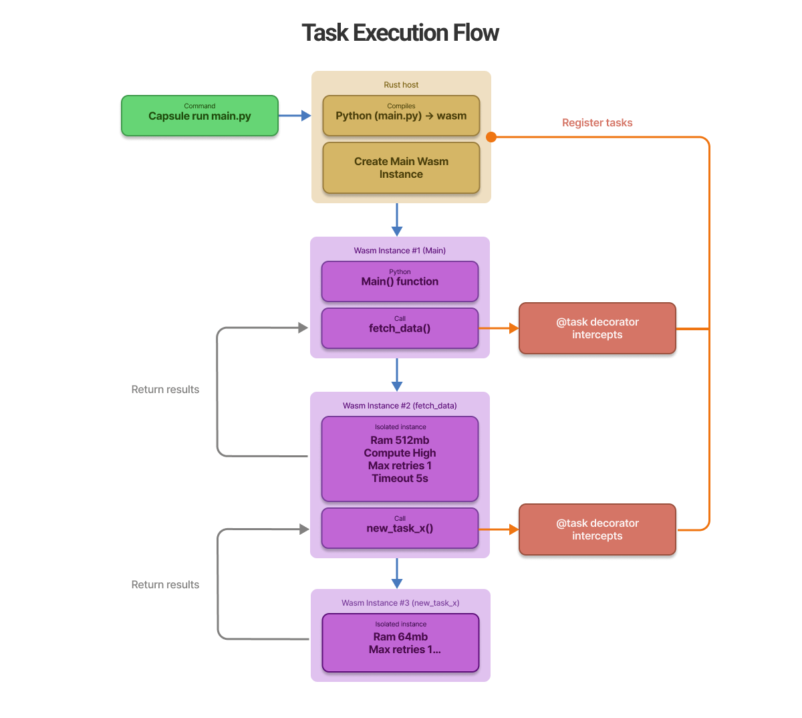

<div align="left">
    
# 📦 Capsule

[](LICENSE)
[](https://www.rust-lang.org/)

**A durable runtime for agentic workflows**


https://github.com/user-attachments/assets/539f7c72-6847-4a25-9a76-d55028267cd7


</div>

---

## 🎯 What is Capsule?

Modern AI agents are evolving from simple, single-threaded scripts into **distributed multi-agent architectures** that coordinate sub-agents in parallel. These systems handle long-running workflows, large-scale data processing, and complex decision-making tasks that require:

- 🔒 **Robust isolation** between untrusted code and your host system
- 📊 **Fine-grained resource control** (CPU, RAM, timeout limits)
- 🔄 **Automatic retry mechanisms** for resilient execution
- 📈 **Observable task execution** with comprehensive monitoring

**Capsule** is a durable runtime for agentic workflows that gives you complete control over task execution through WebAssembly sandboxing. Build reliable, scalable agent systems with confidence.


## 🚀 How It Works

Capsule leverages **WebAssembly (Wasm)** to create secure, isolated execution environments for each task. Simply annotate your Python functions with `@task` decorator :

```python
from capsule import task

@task(name="analyze_data", compute="MEDIUM", ram="512MB", timeout="30s", max_retries=1)
def analyze_data(dataset: list) -> dict:
    """Process data in an isolated, resource-controlled environment."""
    # Your code runs safely in a Wasm sandbox
    return {"processed": len(dataset), "status": "complete"}
```

This diagram illustrates the complete journey of a task from your command line invocation to execution within the Rust core



When you run `capsule run main.py`, your Python code is compiled into a WebAssembly module and executed in a dedicated, isolated Wasm instance managed by Capsule's Rust runtime. 

Each task operates within its own sandbox with configurable resource limits, ensuring that failures are contained and don't cascade to other parts of your workflow. The host system controls every aspect of execution, from CPU allocation via Wasm fuel metering to memory constraints and timeout enforcement.

## 🏁 Quick Start

### Prerequisites

- **Rust** (latest stable) - [Install Rust](https://rustup.rs/)
- **Python 3.13+** - [Install Python](https://www.python.org/downloads/)

### Installation

```bash
# Clone the repository
git clone https://github.com/mavdol/capsule.git
cd capsule

# Install the Capsule CLI
cargo install --path crates/capsule-cli

# Install the Python SDK in your workspace
pip install -e crates/capsule-sdk/python
```

### Your First Capsule Task

Create a file called `hello.py`:

```python
from capsule import task

@task(name="hello_capsule", compute="LOW", ram="64MB")
def main() -> str:
    """Your first isolated task!"""
    return "Hello from Capsule! 📦✨"
```

> [!NOTE]
> When running Python tasks, the first execution may take a few seconds. Capsule needs to compile the full Python interpreter to Wasm (Cold Start). Subsequent runs are **instant** thanks to the built-in caching.

Run it:

```bash
capsule run hello.py
```

That's it! Your Python function just ran in a secure WebAssembly sandbox. 🎉

## 📚 Documentation

### Task Configuration Options

Configure your tasks with these parameters:

| Parameter | Type | Description | Example |
|-----------|------|-------------|---------|
| `name` | `str` | Task identifier (defaults to function name) | `"process_data"` |
| `compute` | `str` | CPU allocation level: `"LOW"`, `"MEDIUM"`, or `"HIGH"` | `"MEDIUM"` |
| `ram` | `str` | Memory limit for the task | `"512MB"`, `"2GB"` |
| `timeout` | `str` | Maximum execution time | `"30s"`, `"5m"`, `"1h"` |
| `max_retries` | `int` | Number of retry attempts on failure (default: 1) | `3` |
| `env_vars` | `dict` | Environment variables accessible within the task | `{"KEY": "value"}` |

### Compute Levels

Capsule controls CPU usage through WebAssembly's **fuel mechanism**, which meters instruction execution. The compute level determines how much fuel your task receives.
- **LOW** provides minimal allocation for lightweight tasks
- **MEDIUM** offers balanced resources for typical workloads
- **HIGH** grants maximum fuel for compute-intensive operations
- **CUSTOM** to specify an exact fuel value (e.g., `compute="1000000"`) for precise control over execution limits.

### HTTP Client API

Standard Python networking relies on sockets, which aren't natively compatible with WebAssembly's sandbox model. For security and portability, Capsule provides its own HTTP client that works seamlessly within the Wasm environment while maintaining strict isolation boundaries:

```python
from capsule import task
from capsule.http import get, post, put, delete

@task(name="http_example", compute="MEDIUM", timeout="30s")
def main() -> dict:
    """Example demonstrating HTTP client usage within a task."""

    # GET request
    response = get("https://api.example.com/data")

    # POST with JSON body
    response = post("https://api.example.com/submit", json={"key": "value"})

    # Response methods
    is_ok = response.ok()           # Returns True if status code is 2xx
    status = response.status_code    # Get the HTTP status code
    data = response.json()           # Parse response as JSON
    text = response.text()           # Get response as text

    return {"status": status, "success": is_ok}
```

## 🔧 Compatibility

**Current Version**: v0.1 (Python support only)

### What Works

✅ **Supported:**
- CPython 3.11 inside WebAssembly
- Standard library modules: `json`, `math`, `re`, `datetime`, `collections`, etc.
- Pure Python packages and libraries
- Basic I/O operations

### Important Limitations

Packages with C extensions like `numpy` and `pandas` are not yet supported in the current version. Support for compiled extensions is planned for future releases as Capsule expands WebAssembly compatibility.

## 📅 What's Next

> [!IMPORTANT]
> The path from v0.2 onwards is flexible. While the initial vision is for a Daemon mode your feedback defines the priority.

#### v0.2.0: The Orchestrator

**Status:** Planned

**Goal:** Turning the runner into a stable, persistent system.

- [ ] **Daemon Mode:** Implement the client-server architecture and IPC communication.
- [ ] **Basic Config:** Support `capsule.toml` to identify projects (Namespacing).
- [ ] **Management:** `list` (Tree View), `restart`, and `stop` commands.
- [x] **Resilience:** Retry logic and real Timeout handling (Wall clock).

Check out the [roadmap](./ROADMAP.md) for more details.

## 📝 Engineering Logs

Want to follow along with Capsule's development journey? I share detailed engineering logs, technical deep-dives, and behind-the-scenes insights on Substack:

**[📖 Read the Engineering Logs](https://capsuleruntime.substack.com/)**


## 🤝 Contributing

Contributions are welcome! Here's how you can help:

1. **Fork** the repository
2. **Create** a feature branch: `git checkout -b feature/amazing-feature`
3. **Add tests** if applicable: `cargo test`
4. **Open** a Pull Request

Need help or have questions? [Open an issue](https://github.com/mavdol/capsule/issues)


## 📄 License

This project is licensed under the **Apache License 2.0** - see the [LICENSE](LICENSE) file for details.

---

<div align="center">
[⭐ Star us on GitHub](https://github.com/mavdol/capsule)
</div>
